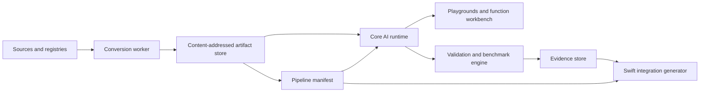

# Core AI Lab: Grand Plan

Status: proposed product and architecture plan

Date: June 19, 2026

Primary platform: macOS 27

North star: LM Studio immediacy plus Create ML guidance for the entire Core AI deployment lifecycle

## 1. Executive decision

Core AI Lab should become a **project-centered Core AI workbench**, not a larger example gallery and not an LLM-only chat app.

The product promise is:

> Bring in a model or choose a known recipe, turn it into a Core AI deployment, prove that it works, understand how it performs on Apple hardware, and export a reproducible app integration.

The core unit is a **Lab Project**, not a single `.aimodel` file. A project can contain source checkpoints, tokenizers, multiple model assets and functions, host-side transforms, mutable state, target-specific variants, validation fixtures, benchmarks, and exported integration code.

This matches the actual Core AI ecosystem. Apple’s own model repository produces resource folders containing one or more `.aimodel` files plus supporting resources, because language models need tokenizers and diffusion systems run multiple models in sequence. Chatterbox Turbo already proves the same point locally: four assets, six Core AI entrypoints, and a native orchestration layer are one model experience.

## 2. Evidence base

This plan was reconstructed from all relevant local Codex history, then checked against the current repository and Apple’s current public Core AI surface.

The local history search covered 1,901 rollout files. After excluding injected instructions, memory summaries, unrelated “core AI” wording, and duplicate subagent context, the useful lineage was:

| Thread | What it contributed |
| --- | --- |
| `019e78ea-536e-7b12-a7e6-0d33b66b3be3` | The pre-WWDC thesis that Apple’s on-device stack would grow beyond Foundation Models, plus the desire for an inspector app and a broader category rather than one framework wrapper. |
| `019ea5b0-082e-76c2-94c5-c859880eab1d` | Local Xcode 27 SDK archaeology, the original Core AI example app and API notes, discovery of Apple’s `coreai-models` package, the Lab naming, and the repository rename. Seven attached helper rollouts independently checked API, docs, packaging, and repo impact. |
| `019ec424-50fe-7f32-bf1f-f372caa80c75` | The complete Chatterbox Turbo journey: model selection, official conversion tools, environment resolution, graph partitioning, unsupported-op rewrites, specialization failures, parity, quantization, native Swift orchestration, audio QA, cutoff repair, profiling, rejected optimizations, voice provenance, iPhone constraints, Git LFS, and PR hardening. |

Current official references:

- [Core AI documentation](https://developer.apple.com/documentation/coreai/)
- [Meet Core AI](https://developer.apple.com/videos/play/wwdc2026/324/)
- [Core AI model authoring and optimization](https://developer.apple.com/videos/play/wwdc2026/325/)
- [Apple Core AI Models](https://github.com/apple/coreai-models)
- [Apple Core AI PyTorch Extensions](https://github.com/apple/coreai-torch)

## 3. What exists today

The repository began as a strong vertical prototype:

- A SwiftUI macOS/iOS shell with a Chatterbox workspace and an early runtime catalog.
- Four bundled Chatterbox `.aimodel` assets totaling roughly 600 MiB.
- Six native Core AI functions:
  - T3 embeddings: `prefill`, `decode`
  - T3 transformer: `prefill`, `decode`
  - S3Gen: `main`
  - vocoder: `vocoder`
- A native Swift actor that tokenizes, samples, manages KV cache updates, runs the model stages, trims output, writes WAV audio, and records stage timings.
- A locked Python conversion environment using Apple’s `coreai-torch` path.
- Bespoke adapters for T3, S3Gen, the HiFT vocoder, and reference encoders.
- PyTorch parity tests, Core AI runtime validation, native contract tests, a known no-cut regression sentence, and measured Release performance.

The original limiting architecture was also clear:

- `ContentView` was a two-tab demo shell.
- `CoreAIRuntimeView` was a static list rather than a recipe-backed studio.
- `ChatterboxCoreAIEngine` remains a model-specific runtime adapter, but its asset
  paths, native entrypoints, display metadata, target preference, tokenizer, and
  capacity now come from a validated bundled recipe manifest.
- Conversion was reproducible from the terminal but invisible to the app.
- Large assets lived only in the app bundle and Git history rather than a managed artifact library.
- Experiments and benchmarks existed as chat/terminal evidence, not durable project records.

The next step is therefore not “add another model tab.” It is to extract the system hiding inside Chatterbox.

### Implementation checkpoint — June 20, 2026

The first platform slice is now represented in the repository:

- A native `NavigationSplitView` shell with Apple Models, Chatterbox, Asset Inspector, and Runtime surfaces.
- A SwiftData-backed Lab Project library with atomic, streamed SHA-256 artifact
  imports, cross-project deduplication, safe last-reference cleanup, corruption
  checks, and direct Inspector/Workbench handoff. Completed conversion outputs
  can be promoted into projects without depending on their original folder.
- A versioned Codable recipe vocabulary for targets, artifacts, typed pipeline
  stages, and capacity, with strict schema, reference, entrypoint, and safe-path
  validation. Chatterbox Turbo ships the first concrete manifest.
- Persistent recipe-revision snapshots, target profiles, typed run state, and
  evidence metadata connected to Lab Projects, with reopen coverage and
  migration-safe defaults for the additive schema.
- Chatterbox resolves all four model paths, six native entrypoints, tokenizer,
  target preference, presentation metadata, and generation capacity from its
  manifest. Neither its UI nor engine enumerates bundled model filenames.
- A generated, pinned snapshot of all 33 presets in Apple’s open-source `coreai-models` registry.
- Search, category filters, recipe provenance, exact conversion defaults, and Swift runtime-product mapping.
- Generic `.aimodel` import and inspection.
- Full function input/state/output contract inspection, exact public
  specialization-cache hit/miss checks, four compute profiles, standard
  reclaimable cache policy, and scoped cache removal. Persistent policy stays
  gated until Lab Projects retain Core AI bookmarks and can delete entries after
  source removal.
- A generic function workbench for supported stateless NDArray-input functions,
  with dynamic-shape editing, zero or seeded-random generation, bounded tensor
  allocation, fresh function loading, timed inference, and sampled numeric
  output summaries.
- A first generic benchmark lab with full compute/reshape specialization cache
  identity, one excluded warmup and five measured runs by default, raw trial
  visibility, robust summaries, environment and thermal metadata, Release-build
  guidance, session comparisons, and cancellation between Core AI calls.
- Deterministic standalone-asset integration export from the function
  workbench, including the original model, a versioned contract manifest,
  streamed SHA-256 evidence, and generated Swift invocation code for stateless
  NDArray functions. A generated `coreai-build` script exposes optional iOS and
  macOS 27 ahead-of-time compilation without running it implicitly. Stateful
  and image-input functions remain explicitly manifest-only until a semantic
  adapter owns their lifecycle.
- A checked-in two-function Core AI fixture proving real Float32 and Int32
  specialization and inference rather than only mocked orchestration.
- A runnable YOLOS Tiny playground built on Apple’s `CoreAIObjectDetection` package, with image import, Core AI execution, bounding-box overlays, confidence values, and an accessible result table.
- Runnable EfficientSAM and SAM 3 playgrounds built on Apple’s `CoreAISegmentation` package, with point or text prompts, bundle-aware conversion handoff, mask overlays, and explicit gated-weight licensing boundaries.
- A runnable Qwen3 0.6B playground built on Apple’s `CoreAILanguageModels`
  package and `FoundationModels`, with macOS and iOS export recipes,
  bundle-aware conversion handoff, bounded generation, cancellation, and
  session reset.
- A descriptor-driven diffusion playground built on Apple’s
  `CoreAIDiffusionPipeline` package, with runtime dispatch across Stable
  Diffusion 1.x/2.x, SD3.5, and FLUX.2, editable generation controls,
  cancellation, image output, and bundle-aware conversion handoff.
- A runnable Wav2Vec2 audio playground built directly on Core AI, with
  AVFoundation decoding and 16 kHz mono resampling, static-contract validation,
  greedy CTC decoding, timing, and direct conversion handoff.
- A versioned recipe-to-experience registry drives Runtime Studio navigation,
  workload grouping, current-OS availability, and capability presentation.
  Multiple segmentation and diffusion recipes reuse one semantic adapter
  without adding another navigation screen.
- Qwen, YOLOS, EfficientSAM/SAM 3, Wav2Vec2, and diffusion workspaces share a
  run coordinator for running/succeeded/failed/canceled state, session-scoped
  cold/warm classification, and comparison identity. Users can optionally
  record future runs into a Lab Project; successful runs add measured timing
  metric evidence without fabricating output artifacts. Imported families are
  checked against the selected registry intent; because current exports do not
  prove an artifact-bound recipe revision, each persisted run has explicit
  `unverified_intent` validation evidence and no recipe snapshot is linked.
  Terminal status plus timing evidence is an idempotent write that remains
  retryable after a persistence failure.
- A macOS Conversion Workbench that configures every pinned Apple recipe, validates the local `uv`/Xcode/repository/storage environment, previews typed arguments, launches conversion without a shell, streams logs, supports cancellation, persists evidence, discovers outputs, and hands artifacts to the inspector.
- A reproducible catalog-refresh script and gated integration test.

This proves the Library -> Recipe -> Convert -> Inspect -> Specialize -> Run
loop without pretending that Apple distributes converted weights. Milestone 0's
schema, manifest, and persistence foundation slice is implemented; automatic
workspace run/evidence capture remains follow-up integration. Milestone 1's
project-library slice now unifies deterministic resource-folder metadata,
durable descriptor snapshots, editable source provenance, and project-owned
specialization-cache cleanup with the existing generic function workbench and
integration export. Milestone 2 now has a shared registry and lifecycle slice,
while embeddings, persistent output files, real modality-aware comparisons,
imported bookmarks, and cross-launch active-run recovery remain open.
Restart-safe conversion execution remains Milestone 3 work.

## 4. Product boundary

### What “every Core AI” means

It means broad support across Core AI workloads and deployment shapes:

- language models
- embeddings and text encoders
- image classification, detection, segmentation, depth, and super-resolution
- diffusion pipelines
- speech recognition and audio encoders
- text-to-speech and other custom audio pipelines
- generic tensor/image functions
- multi-asset and stateful pipelines

It does **not** mean every PyTorch repository is guaranteed to convert automatically. There are three explicit support tiers:

1. **Curated** — Apple registry models and Lab recipes with known environments, shapes, compression, runtime adapters, and golden validations.
2. **Guided experimental** — a PyTorch module or Hugging Face repository with example inputs. The Lab probes it, runs `torch.export`, reports unsupported operations, and generates a recipe workspace, but manual authoring may remain.
3. **Bring-your-own `.aimodel`** — any valid asset can be inspected, specialized, and exercised with the generic function workbench. A rich task UI requires a semantic adapter or recipe.

### Non-goals for the first product

- Training or fine-tuning models inside the app.
- A promise of arbitrary one-click Hugging Face conversion.
- A replacement for Apple’s Core AI Debugger, Xcode model viewer, Core AI gauge, or Instruments template.
- A raw operator-level visual graph editor.
- Cloud-hosted inference or an account system.
- iPhone-first conversion. Authoring and validation begin on Mac; deployment profiles come next.

Apple already provides deep model visualization, numeric debugging, tensor-source tracing, and performance instrumentation. Core AI Lab should orchestrate those tools, preserve evidence from them, and fill the missing workflow between a source model and a shippable app.

## 5. The north-star workflow

1. **Create a Lab Project** from a Hugging Face model, local PyTorch workspace, Apple registry preset, existing resource bundle, or `.aimodel` file.
2. **Run Environment Doctor** to resolve Xcode, SDK, architecture, Python, `uv`, wheel compatibility, disk capacity, compute units, and source-license requirements.
3. **Choose a target profile** such as “Mac GPU,” “Mac portable,” or “iPhone Neural Engine.”
4. **Inspect or define the pipeline**: assets, entrypoints, input/state/output contracts, tokenizer/resources, host transforms, and example inputs.
5. **Convert** through a visible, resumable job graph: acquire, probe, author, compress, export, lower, optimize, save, inspect, specialize, and validate.
6. **Resolve blockers** with precise unsupported-operation reports, linked source locations, known rewrite patterns, and generated adapter stubs.
7. **Run the model** in a task-appropriate playground or the generic function workbench.
8. **Compare variants** using deterministic fixtures and modality-aware output comparisons.
9. **Benchmark** cold specialization, warm load, per-stage inference, host work, memory, storage, throughput, energy, and thermal behavior.
10. **Export** a resource folder, manifest, notices, generated Swift integration, and a verification report.

The user should be able to stop after step 1 and play with a curated model, or continue all the way through step 10 when doing real model engineering.

## 6. Information architecture

The macOS app should use a native `NavigationSplitView`, toolbar, inspector, and optional bottom console rather than top-level tabs.

```text
┌──────────────────┬──────────────────────────────────────┬───────────────────┐
│ Library          │ Project / active tool                │ Inspector         │
│                  │                                      │                   │
│ Recent Projects  │ Overview · Run · Convert · Pipeline  │ Contract          │
│ Models           │ Variants · Benchmarks · Export       │ Target            │
│ Recipes          │                                      │ Provenance        │
│ Conversions      │ Main editor, preview, or comparison  │ Evidence          │
│ Benchmarks       │                                      │                   │
│                  ├──────────────────────────────────────┴───────────────────┤
│ Device Doctor    │ Collapsible job log / diagnostics / command transcript  │
└──────────────────┴──────────────────────────────────────────────────────────┘
```

The visual language should inherit the strongest ideas from MusaveraLab: a native split-view shell, quiet system backgrounds, one restrained accent, semantic status color, monospaced live metrics, evidence-rich visualizations, and a persistent action/status bar for long-running work. The model, waveform, spectrogram, benchmark trace, or pipeline should provide the visual interest. Avoid turning the product into a grid of oversized score cards or wrapping every region in material.

### Primary surfaces

#### Home and onboarding

- Detect the current Apple silicon architecture and compute units.
- Find installed Xcode versions instead of assuming a fixed path.
- Verify Core AI SDK availability, `uv`, compatible Python, converter packages, disk space, and optional device destinations.
- Offer two starts: run a small curated model or open the Chatterbox golden project.
- Teach that first specialization can be expensive and cached.

#### Model Library

- Browse local projects, source checkpoints, resource bundles, and asset variants.
- Browse Apple’s current `coreai-models` registry by workload, platform, size, and license.
- Download on demand with resume, checksum, provenance, and license acknowledgement.
- Show source size, Core AI size, specialized-cache size, target compatibility, and last verified state.
- Purge source artifacts and specialization caches independently.

#### Asset Inspector

- Validate `AIModelAsset` and display metadata, functions, operations, compute/storage types, and statistics.
- Render input, state, and output descriptors in a searchable outline.
- Compare two assets or variants structurally.
- Specialize to an explicit compute unit and manage the relevant `AIModelCache` entries.
- Provide “Open in Xcode/Core AI Debugger” and “Profile with Instruments” handoffs rather than duplicating Apple’s tools.

#### Function Workbench

- Auto-generate input editors from function descriptors.
- Support zeros, random tensors, imported NumPy data, images/pixel buffers, and recipe-provided fixtures.
- Let the user choose values for dynamic dimensions and allocate state/output buffers from descriptors.
- Run once, repeat, or warm-benchmark.
- Inspect numeric summaries and export raw outputs.
- Add semantic renderers when a recipe labels a value as text logits, embedding, image, mask, audio, tokens, or scalar classes.

#### Playgrounds

Task-specific experiences sit on top of the same runtime:

- Chat and text generation
- Embedding similarity
- Image classification/detection/segmentation/depth
- Diffusion generation
- Speech-to-text and audio embeddings
- Text-to-speech

These are a bounded set of built-in experiences, not one custom screen per model. Recipes map model contracts into them.

#### Conversion Workbench

Two lanes keep the promise honest:

- **Known recipe** — select model, platform, context, precision, and compression; the Lab resolves Apple’s registry defaults and runs the supported export.
- **Experimental model** — select source, module/entrypoints, example inputs, dynamic dimensions, state names, and target. The Lab probes exportability and builds a recipe workspace.

The visual graph shows deployment stages and artifacts, not decorative replicas of every neural-network operation. Selecting a failed stage reveals:

- exact exception and source location
- unsupported ATen/Core AI operation
- module stack and example shapes
- known decomposition or authoring rewrite
- custom-lowering or `TorchMetalKernel` escape hatch
- generated test and adapter stub

#### Pipeline Studio

An asset-level typed DAG connects:

- source/input adapters
- tokenizers and preprocessors
- Core AI asset functions
- mutable state
- seeded randomness
- small host operators
- samplers and decoders
- post-processing and output encoders

This is where Chatterbox’s four assets become visible as one system. It is also the correct abstraction for diffusion pipelines and language-model prefill/decode loops.

#### Variant and Benchmark Lab

- Build a matrix of precision, compression, block/group size, context/shape profile, compute unit, and target platform.
- Run cold and warm trials separately.
- Record specialization, load, model inference, host work, end-to-end latency, throughput/RTF, peak memory, storage, energy, and thermal state.
- Compare task quality using modality-aware evidence:
  - logits/token agreement and perplexity-like measures
  - embedding cosine similarity
  - image diff and task metrics
  - transcription, clipping, pitch, spectrum, and listening fixtures for audio
- Require every comparison image or chart to label both variants, source fixture, seed, hardware, and run state.

#### Export

- Produce a resource folder with assets, tokenizer/resources, manifest, checksums, metadata, and third-party notices.
- Optionally ahead-of-time compile with `coreai-build` for chosen architectures.
- Generate Swift integration code and a minimal Xcode sample target.
- Export a machine-readable verification report with the exact recipe/environment and benchmark evidence.

## 7. System architecture



### Process boundaries

#### Swift app

- SwiftUI shell and project navigation
- project, artifact, recipe, run, and evidence domain models
- Core AI asset inspection, specialization, caching, and inference
- pipeline orchestration
- previews, comparisons, and export generation
- job control, structured progress, cancellation, and logs

#### Python conversion worker

- One isolated `uv` environment per recipe/toolchain lock
- checkpoint acquisition and source loading
- PyTorch compatibility adapters
- `coreai-opt` compression exploration
- `torch.export` and decomposition
- `coreai-torch` conversion and Core AI IR optimization
- PyTorch/Core AI parity fixtures

The first implementation can use `Process` behind an actor with `AsyncStream` output. Before distributing a notarized product, move untrusted and long-running work into a dedicated helper/XPC boundary. Never mutate the user’s global Python environment.

#### External Apple tools

- `coreai-build` for inspection and ahead-of-time compilation
- Core AI Debugger for graph/numeric inspection
- Xcode/Core AI gauge and Instruments for profiling
- Apple’s `coreai-models` registry and Swift runtime utilities where available

### Storage model

Use the file system for large blobs and SwiftData for metadata. The artifact store is content-addressed by SHA-256 and uses atomic moves, so duplicate variants and interrupted downloads do not multiply storage or corrupt projects.

Core entities:

- `LabProject`
- `SourceRevision`
- `RecipeRevision`
- `TargetProfile`
- `ConversionRun`
- `ModelAssetRecord`
- `ArtifactVariant`
- `PipelineManifest`
- `ValidationRun`
- `BenchmarkRun`
- `EvidenceArtifact`
- `ExportPackage`

Core AI’s specialization cache remains framework-managed and is referenced by the project rather than copied into the artifact store.

### Suggested module layout

```text
CoreAILab/                 SwiftUI application
Packages/
  CoreAILabDomain/         Projects, recipes, manifests, run records
  CoreAILabArtifacts/      Downloads, hashes, storage, licenses
  CoreAILabRuntime/        Asset inspection, specialization, inference
  CoreAILabPipelines/      Typed DAG and host operators
  CoreAILabConversion/     Worker protocol, jobs, diagnostics
  CoreAILabBenchmarks/     Trials, metrics, comparisons, evidence
  CoreAILabExperiences/    Built-in task renderers/editors
  CoreAILabExport/         Resource bundles and Swift generation
Recipes/
  ChatterboxTurbo/
  OfficialRegistry/
Workers/
  Python/
```

Keep UI and model engineering separate. No model-specific constants should migrate into a view model.

## 8. Recipe and pipeline contract

The recipe format is the product’s most important API. It should be versioned, declarative where possible, and allow code-backed escape hatches.

Illustrative Chatterbox shape:

```yaml
schemaVersion: 1
id: resemble/chatterbox-turbo
displayName: Chatterbox Turbo
source:
  repository: ResembleAI/chatterbox-turbo
  revision: <pinned revision>
  license: MIT
environment:
  python: "3.12"
  lockfile: Conversion/Chatterbox/uv.lock
targets:
  mac-gpu:
    platform: macOS
    computeUnit: gpu
artifacts:
  t3Embeddings:
    file: ChatterboxTurboT3Embeddings.aimodel
    functions: [prefill, decode]
  t3Transformer:
    file: ChatterboxTurboT3TransformerInt4.aimodel
    functions: [prefill, decode]
  s3gen:
    file: ChatterboxTurboS3Gen.aimodel
    functions: [main]
  vocoder:
    file: ChatterboxTurboVocoder.aimodel
    functions: [vocoder]
pipeline:
  experience: textToSpeech
  graph: Pipeline/chatterbox.pipeline.json
validation:
  fixtures: Validation/fixtures.json
  parity: Validation/parity.json
  capacity:
    maximumTextTokens: 256
    maximumSpeechTokens: 253
    requireStopToken: true
```

The manifest records contracts and provenance; it does not try to encode arbitrary Python logic. A recipe can reference Python authoring modules and built-in runtime host operators. Truly custom runtime behavior ships as a small Swift adapter package generated or authored beside the recipe.

## 9. Chatterbox lessons turned into requirements

| What happened | Product requirement |
| --- | --- |
| Chatterbox pinned Torch 2.6 while `coreai-torch` required newer Torch, and Core AI wheels supported only selected Python versions. | Environment Doctor resolves a tested compatibility intersection and locks it per recipe before downloading weights. |
| A headline “350M” model required several checkpoints and a multi-gigabyte source footprint. | Show total source, working, output, bundle, and specialization-cache storage separately. |
| The model was not one graph. | Projects and manifests support multiple assets, entrypoints, tokenizers, and host operations from day one. |
| Seven unsupported vocoder operations required mathematical rewrites and explicit phase/noise inputs. | Unsupported-op diagnostics, rewrite patterns, and stochastic-input contracts are first-class conversion output. |
| Converter success did not guarantee macOS specialization or runtime execution. | Separate gates for export, conversion, asset inspection, specialization, first inference, and parity. |
| Multi-function specialization failed while standalone assets worked. | Packaging can choose one asset per component or multiple functions per asset without changing pipeline semantics. |
| Dynamic decode shapes triggered repeated planning; fixed decode was dramatically faster. | Shape strategy is a named variant dimension and benchmark target, not an invisible implementation detail. |
| Mutable KV state was mathematically correct but did not prove faster for this graph/runtime. | Optimization suggestions remain hypotheses until an A/B run passes correctness and performance gates. |
| Selective INT4 reduced T3 from roughly 591 MB to 222 MB while small audio-critical models stayed FP16. | Compression is configurable by module and sensitivity, with generated token/output evidence before promotion. |
| Internal randomness blocked conversion and made comparisons slippery. | Random sources can become explicit seeded inputs, and every validation stores its seed and generator contract. |
| A fixed 5.12-second graph silently cut speech. | Capacity, stop conditions, trimming, and exhaustion behavior are validated contracts; partial output never silently passes. |
| GPU preference worked while Neural Engine compilation rejected FP32 intermediates and layouts. | Mac/iPhone/compute-unit profiles are separately authored and verified. A specialization toggle never implies deployment support. |
| The “calm voice” work exposed celebrity-clone and demo-recording provenance issues. | License, reference-media provenance, redistribution rights, and generated-conditioner status are visible before export. |
| Large obsolete model blobs made Git LFS publishing fragile. | Model artifacts live outside source history in a resumable content-addressed store with manifests and checksums. |
| Xcode tool selection repeatedly pointed at an SDK without Core AI. | Tool discovery is dynamic, and every run records the exact Xcode build and SDK. |
| An unlabeled spectrogram was later misinterpreted. | Comparison artifacts are self-labeling and carry machine-readable provenance. |

## 10. Roadmap

Estimates assume one focused senior engineer and include product-quality tests. They are directional, not release promises.

### Milestone 0 — Extract the platform foundation (2 weeks)

Implementation status: the platform-foundation slice is implemented as of June
22, 2026. The existing opt-in Chatterbox model smoke remains the hardware-backed
audio and generation-limit regression gate; the default suite validates manifest
mapping, bounded capacity relationships, and storage contracts without
performing expensive specialization. Automatic run/evidence capture from the
Chatterbox workspace remains follow-up integration work.

Deliverables:

- Introduce `LabProject`, recipe, target, artifact, run, and evidence models.
- Add project persistence and the content-addressed artifact store.
- Move Chatterbox’s asset/function/capacity metadata into a versioned recipe manifest.
- Add Environment Doctor and remove fixed Xcode-path assumptions from documentation and scripts.
- Make the current Chatterbox experience load through the new project/manifest layer with no audio regression.
- Keep Swift 6 language mode on a Swift 6.2-or-newer toolchain and preserve the
  existing actor isolation. (`SWIFT_VERSION` names the language mode, so `6.0`
  is the correct Xcode setting even when the selected compiler is Swift 6.4.)

Done bar:

- The existing Chatterbox output, stop-token guard, tests, and Release path remain intact.
- No UI or engine code enumerates Chatterbox asset filenames directly.

### Milestone 1 — Model Library and universal inspector (3 weeks)

Implementation status: complete for the project-library and generic-runtime
boundary. Hardware specialization and inference remain capability-dependent,
and are exercised by the existing real Core AI fixture rather than simulated by
the library persistence tests.

Deliverables:

- Import `.aimodel` assets and Core AI resource folders.
- Persist metadata, hashes, function descriptors, compute/storage summaries, and source provenance.
- Browse and manage specialization cache entries.
- Add the generic descriptor-driven function workbench.
- Add Apple model-registry browsing and on-demand artifact management.

Done bar:

- A valid third-party `.aimodel` can be imported, inspected, specialized, supplied with generated inputs, run, and exported without adding SwiftUI code.

### Milestone 2 — Runtime Studio (3–4 weeks)

Deliverables:

- Built-in experiences for text, embeddings, vision, audio, and diffusion.
- Recipe-to-experience contract mapping.
- Run history, output artifacts, cold/warm timing, and comparison selection.
- Initial official-registry projects such as Qwen, SAM/CLIP, and Whisper or Wav2Vec2.

Done bar:

- At least one language, one vision, and one audio model run through shared runtime infrastructure.
- Adding the second model in a workload family requires a recipe, not a new screen.

### Milestone 3 — Guided conversion alpha (4–5 weeks)

Initial durability slice: the repository now has a versioned conversion-job
store with legal state transitions, append-only structured logs, explicit
restart reconciliation, and checkpoint reuse decisions bound to the exact
versioned request/toolchain/source identity and store-verified artifact tree
evidence. The current
process runner still starts a fresh converter process after interruption;
automatic workspace adoption, per-gate execution, and end-to-end restart
recovery remain unfinished.

Deliverables:

- Resumable conversion job engine with structured logs and cancellation.
- Known-recipe UI backed by Apple’s model registry.
- Target, context, precision, and compression controls.
- `uv` environment creation and lock capture.
- Export, IR optimization, `.aimodel` save, inspection, specialization, and smoke inference as distinct gates.
- Restart-safe job recovery and artifact reuse.

Done bar:

- A supported Qwen preset can be selected and converted from the app on a clean machine, then run in Runtime Studio.

### Milestone 4 — Custom Recipe Studio (5–7 weeks)

Foundation checkpoint: the repository now has a versioned typed pipeline
manifest, deterministic JSON codec, and structural validator for asset
functions, host operators, explicit state, seeded randomness, and bounded loops.
Recipe Studio adds a deterministic authoring schema and native editors for
PyTorch source/module configuration, example inputs, dynamic dimensions, state,
externalization, and function entrypoints. Pipeline Studio edits the same typed
asset-level graph. Attributed unsupported-op findings, an evidence-backed rewrite
catalog, and deliberately failing custom-lowering/Metal stubs cover the manual
resolution handoff.

This is not Milestone 4 completion. The diagnostic worker, Lab Project recipe
persistence, conversion execution, generic pipeline runtime, and complete
Chatterbox migration remain part of this milestone.

Deliverables:

- PyTorch source/module and example-input configuration.
- Dynamic shape, state, externalization, and function-entrypoint editors.
- Unsupported-op report with module/source attribution.
- Built-in rewrite catalog and generated custom-lowering/Metal-kernel stubs.
- Typed asset-level Pipeline Studio.
- Migrate the complete Chatterbox conversion and runtime orchestration into the recipe system.

Done bar:

- A fresh Chatterbox conversion can be started, resumed, validated, packaged, and run from a Lab Project.
- The current 725-line Chatterbox engine is reduced to generic pipeline execution plus a small bounded set of reusable host operators.

### Milestone 5 — Optimization and evidence lab (4–5 weeks)

Initial slices: the generic function workbench provides a stable in-session
benchmark protocol for deterministic NDArray inputs and selected specialization
configurations, plus validated, deterministic, path-free JSON evidence export
with artifact identity, full trial distributions, environment/toolchain data,
trial-derived aggregate validation, phase-scoped benchmark environment data,
and explicit unsupported metrics. Project-linked persistence, generated
variants, quality gates, and promotion rules remain part of this milestone.

Deliverables:

- Variant matrix for precision, compression, shape/context, compute unit, and platform.
- `coreai-opt` YAML import/export and selective per-module maps.
- Automated parity and capacity gates.
- Modality-aware A/B comparisons.
- Stable benchmark protocol with warmup, repetitions, outlier visibility, and target hardware metadata.
- Evidence report generation.

Done bar:

- Reproduce the Chatterbox FP16-versus-INT4 decision with labeled artifacts and a promotion rule.
- A slower “optimization” cannot replace a current variant without an explicit override.

### Milestone 6 — Integration export and code generation (4–6 weeks)

Initial standalone-asset slice: Integration Export now emits a deterministic,
dependency-free Swift package containing the model resource, typed manifest,
whole-package checksums, reported third-party notices, generated runtime and bundled
resource loader, plus a clean offline verifier that compiles with the installed
SDK without invoking `coreai-build`. Stateless NDArray functions are generated;
stateful and image-input functions remain truthfully manifest-only.

Deliverables:

- Resource-bundle packaging, checksums, notices, and metadata.
- Optional `coreai-build` ahead-of-time compilation.
- Generated Swift project integration and sample app.
- Pipeline runtime package generated from the manifest.
- Export verification on a clean test project.

Done bar:

- Export Chatterbox and one official-registry model into standalone sample apps that build without referencing Core AI Lab internals.

### Milestone 7 — iPhone deployment lab (5–7 weeks)

Deliverables:

- Connected-device target profiles and benchmark runner.
- Static-shape/context authoring assistance for iOS.
- Neural Engine compatibility diagnostics for precision, layout, projection, and unsupported operations.
- App-download/on-demand asset slicing and device storage planning.
- Memory, energy, and thermal trials.

Done bar:

- One language/vision model and one audio pipeline have separately authored, verified iPhone variants.
- The UI never presents “prefer Neural Engine” as proof of Neural Engine compatibility.

### Milestone 8 — Recipe ecosystem (ongoing)

Deliverables:

- Public recipe schema and authoring documentation.
- Curated recipe index with trust and verification states.
- CI verification on supported hardware/SDK matrices.
- Import/export of recipe bundles without executing code until the user grants trust.

Done bar:

- A contributor can add a model family through a reviewable recipe package and validation fixtures, without modifying the main app.

## 11. First 30 days

### Week 1

- Land the domain schema and project persistence.
- Add Environment Doctor.
- Create the Chatterbox recipe manifest and golden fixture inventory.

### Week 2

- Build content-addressed artifact storage and move Chatterbox lookup behind it.
- Add project overview, pipeline outline, provenance, and evidence views.
- Preserve the current one-click synthesis experience.

### Week 3

- Replace the static runtime catalog with the real Model Library and Asset Inspector.
- Add function descriptor browsing and specialization/cache controls.

### Week 4

- Ship the first generic function run with generated tensor inputs.
- Import a small official model outside Chatterbox as the generality test.
- Lock Milestone 1 UX from actual use before starting the conversion worker.

The most important first-month test is not visual polish. It is whether a second model becomes useful without another hardcoded feature folder.

## 12. Testing and release gates

### Unit and schema tests

- recipe decoding, migrations, and validation
- target compatibility and capacity rules
- pipeline type/shape checking
- artifact hashing, deduplication, and atomic recovery
- job state transitions and cancellation

### Conversion tests

- environment resolution from a clean directory
- supported and deliberately unsupported operator fixtures
- deterministic compression and export configuration
- checkpoint/source hash verification
- converter output inspection

### Runtime tests

- specialization and load as separate gates
- input/state/output descriptor compatibility
- deterministic parity fixtures
- cold and warm execution
- visible failures for missing stop conditions, invalid shapes, and exhausted capacity

### Golden projects

1. Small single-function tensor model — fast CI and generic runner.
2. Official language or vision model — registry and task adapter.
3. Chatterbox Turbo — multi-asset, autoregressive, stochastic, audio, quantized, capacity-bound stress test.

### Promotion rule

An artifact variant becomes “recommended” only when it has:

- pinned source and environment
- valid asset inspection
- successful target specialization
- successful first inference
- passed correctness/quality gates
- repeated benchmark evidence
- explicit license/provenance state

## 13. Risk register

| Risk | Mitigation |
| --- | --- |
| Core AI and converter APIs are beta and may change between Xcode seeds. | Version every recipe/run with Xcode build, SDK, wheels, and schema migration. Keep Apple-tool adapters narrow. |
| Arbitrary source repositories can execute Python code. | Default to curated recipes, show trust boundaries, isolate working directories/environments, never enable remote code silently, and move workers behind a helper boundary before distribution. |
| “Visual conversion” creates false expectations of universal automation. | Preserve the support tiers and make manual authoring/code escape hatches visible from the start. |
| Large models consume excessive disk and memory. | Content-addressed storage, on-demand downloads, storage forecasts, cleanup tools, and one-heavy-job resource scheduling. |
| Benchmarks become marketing numbers rather than science. | Store fixtures, seeds, cold/warm state, repetitions, hardware, OS, thermal state, and full distributions. |
| Task UIs become model-specific branches. | A bounded experience registry plus declarative semantic contracts; recipes do not inject arbitrary UI. |
| The app duplicates Apple tooling poorly. | Integrate and hand off to Core AI Debugger, Instruments, model viewer, and `coreai-build`. Focus on workflow and evidence. |
| iPhone becomes a late, painful port. | Make target profiles part of the schema now, while keeping actual iPhone authoring as a later milestone. |
| Model and reference-media licensing is unclear. | First-class license/provenance records and export blocking for unresolved redistribution status. |

## 14. Success metrics

### Activation

- Under 5 minutes from importing a valid `.aimodel` to first successful inference.
- Under 10 minutes from selecting a supported Apple registry model to a running curated playground, excluding weight download and conversion time.

### Generality

- A second model in an existing workload family is added without SwiftUI changes.
- Chatterbox’s complete runtime is represented by the generic pipeline contract plus reusable host operators.

### Reliability

- Curated recipes reproduce successfully on at least 95% of supported clean environments.
- No promoted artifact lacks specialization, first-inference, parity, benchmark, and provenance records.
- Interrupted downloads and conversions resume without corrupting prior artifacts.

### Trust

- Every published performance claim links to a run record.
- Every output comparison identifies variants, fixture, seed, target, and cold/warm state.
- Capacity failures and target incompatibilities are explicit; the product never returns plausible but silently truncated output.

## 15. Final product thesis

LM Studio makes local models approachable. Create ML makes a complex ML workflow legible. Apple’s Core AI toolchain supplies conversion, optimization, debugging, specialization, and inference primitives, but those primitives still live across Python, Xcode, command-line tools, resource folders, and app code.

Core AI Lab should be the place where those pieces become one durable experiment.

Chatterbox is not merely the first demo. It is the acceptance test for the product architecture: if the Lab can faithfully express that conversion—with four assets, six functions, static and dynamic shape tradeoffs, selective quantization, stochastic inputs, native host orchestration, audio validation, licensing boundaries, and separate Mac/iPhone targets—it can credibly grow into the workbench for the rest of Core AI.
